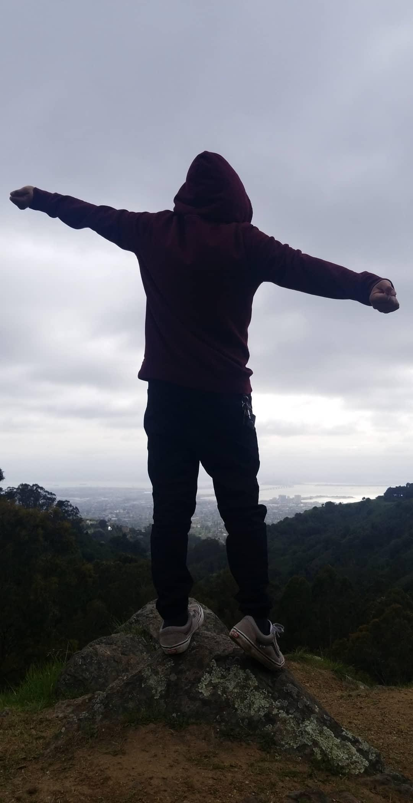

# ReactPortfolio - Portfolio Rendered using React

## Description

This portfolio has been designed to **highlight** some of the accomplishments acheived since beginning the rough, strenuous, and knowledge intensive coding bootcamp program of University of California, Berkeley Extension. It was created with an attempt to **describe** the autor, **navigate** through some of the projects completed since the beginning, and to allow for the user to **communicate** with the author if need be.
The **ReactPortfolio** version was restructured using ***React JavaScript.*** Much of the original HTML code has been modularize to render more efficiently and easier to manage in the long run.

## Purpose

The main goal of this project was to practice the use of **React** and how modularization works to better increase functionality and efficiency of the applications by breaking down its components into smaller apps and rendering using a single js file.

File structuring makes it easier to _debug_ this application. The interface of the React App also adds ease of debugging with instant feedback of what folder/file/line may be problematic to the rendering.

## Table of Contents

* [Description](#description)
* [Purpose](#purpose)
* [Technologies](#technologies)
* [Usage](#usage)
* [Credits](#credits)
* [License](#license)

## Technologies:

The technologies used to create this terminal application are as follows:
- JavaScript
- React.js
- React-router-dom
- Node.js
- Node Package Manager
- GitHub
- GitBash terminal
- Google (...so much)

## Usage 
Curious about who ***Adrian Romero*** is?
Need a *Full Stack Developer*?
Well...you're in LUCK!!

Click through the webpage to get a glimps of the mind and experience of me as a full stack developer. 
The ***About*** page shares with you who I am and where I come from.
The ***Portfolio*** page lets you see some of the work I have done since I started my journey as a developer

If you liked what you see, 
    or you think I'd be a good fit to your team,
then head over to the ***Contact*** section. 
This is where you can reach out with a comment. Just make sure you provide your full name and email and I will get back to you.

Still curious?
follow the link to my ***linkedin** account found on the footer
and check out my work on github too!

[Adrian'sGithub](https://github.com/adrianromero13)

## Credits

* Collaborators with folder structure: 
    - **[Adrianromero13](http://github.com/adrianromero13)**
    - **[Armande925](http://github.com/armande925)**
    - **[Markmesina](https://github.com/markmesina)**
    - **[Markyounan11](https://github.com/markyounan11)**

* UC Berkeley, Extensions Full Stack Development BootCamp Instructors & Assistants
    - Manny Jucaban
    - Musa Akbari
    - Amanda Crawford

* Google inc.           **[Google](https://www.google.com)**
* NPM Registry          **[NMP](https://docs.npmjs.com/)**
* stefanmaretic         **[stickyFooter](https://codesandbox.io/u/stefanmaretic)**
* GitHub                **[GitHub](https://github.com/)**
    
    

## License

[GNU General Public License v3.0](./LICENSE.txt)

## Contributing

[Contributor Covenant](https://www.contributor-covenant.org/)

---
Adrian Romero 2020 React App Project Portfolio

